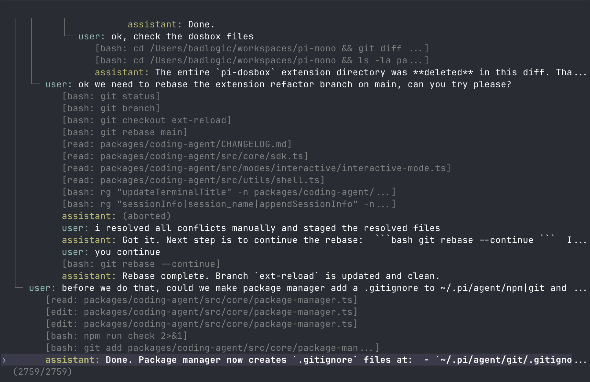
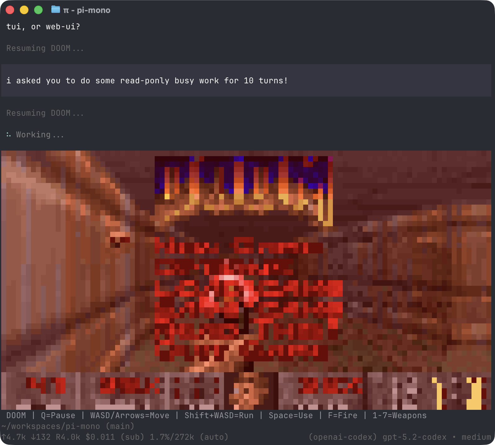

# Apex Code

A provider-agnostic agentic coding harness, forked from Pi. Apex Code combines Pi's
provider and terminal foundations with permissions, scalable context,
a broader tool surface, delegation, durable execution, evidence, and cost visibility.

## Install

`latest` names the newest stable release and a plain install resolves
it. It requires Node.js 22.19 or newer. It installs the same way with npm, pnpm, Yarn, or
Bun — all resolve it from the same npm registry:

```bash
npm install --global apex-code      # npm
pnpm add --global apex-code         # pnpm
yarn global add apex-code           # Yarn
bun add --global apex-code          # Bun

apex-code --version
apex-code
```

Apex Code does not operate a separate shell/curl installer or a standalone binary
release channel — a package manager install is the only distribution channel. Update
it the same way:

```bash
npm install --global apex-code
# or, from an existing installation:
apex-code update --self
```

## First run

Configure a model provider interactively with `/login <provider>`, or use
`apex-code auth check --provider <provider>` to verify credentials. Run
`apex-code --help` for flags and `apex-code --mode rpc` for process integration.

Inside a session, `/config` is a searchable index for settings, models, provider
authentication, and project trust. Resource, extension, and MCP-adapter changes remain
in the dedicated `apex-code config` manager so their scope and trust behavior stay
explicit.

Sessions, settings, credentials, extensions, prompts, and other state live under
`~/.apex-code/agent/` by default. Project-local resources live under `.apex-code/`.

## Safety and capabilities

Every tool has a declared contract and passes through the permission gate. Apex Code ships
no built-in sandbox: built-in tools, extensions, and package installs run with the
permissions of the account that started the CLI. The gate is a policy layer, not OS
containment. For untrusted repositories, generated code you will not review, or unattended
runs, run the CLI inside a container or VM. Windows container and VM isolation works the
same way.
Built-in capabilities include file/search tools, shell execution, web tools, user
questions, planning, and bounded subagent delegation.

## Network and privacy

Apex Code sends no install or update telemetry to this project. At startup it may make
a single version request to the npm registry for `apex-code`; set
`APEX_CODE_SKIP_VERSION_CHECK=1` to disable it. `APEX_CODE_OFFLINE=1` disables startup
network operations. Model requests go to the provider you configure. Optional OTLP
traces are exported only when you explicitly configure your own collector.

Bundled model catalogs work without a hosted catalog. A remote overlay is contacted only
when `APEX_CODE_MODEL_CATALOG_URL` names one. `/share` asks before uploading the complete
HTML session to a secret (unlisted, not private) GitHub Gist; it returns the Gist URL and
adds a preview link only when `APEX_CODE_SHARE_VIEWER_URL` names a viewer.

## Environment compatibility

Canonical runtime controls use the `APEX_CODE_*` prefix, including
`APEX_CODE_OFFLINE`, `APEX_CODE_SKIP_VERSION_CHECK`, `APEX_CODE_PACKAGE_DIR`,
`APEX_CODE_EXPERIMENTAL`, `APEX_CODE_MODEL_CATALOG_URL`, and `APEX_CODE_SHARE_VIEWER_URL`. Temporary `PI_*` aliases
remain for compatibility through the pre-1.0 line and will be removed no earlier than
Apex Code 1.0.0 and 2027-02-16. Canonical values win when both forms are set.

### Supported providers

**API keys:**
- Anthropic
- Ant Ling
- OpenAI
- Azure OpenAI
- DeepSeek
- NVIDIA NIM
- Google Gemini
- Google Vertex
- Amazon Bedrock
- Mistral
- Groq
- Cerebras
- Cloudflare AI Gateway
- Cloudflare Workers AI
- xAI
- OpenRouter
- Vercel AI Gateway
- ZAI Coding Plan (Global)
- ZAI Coding Plan (China)
- OpenCode Zen
- OpenCode Go
- Hugging Face
- Fireworks
- Together AI
- Baseten
- Kimi For Coding
- Meta
- MiniMax
- Xiaomi MiMo
- Xiaomi MiMo Token Plan (China)
- Xiaomi MiMo Token Plan (Amsterdam)
- Xiaomi MiMo Token Plan (Singapore)

Extension callback variable names, the package manifest `pi` key, and imports from
`@earendil-works/pi-ai` / `@earendil-works/pi-tui` are retained compatibility and
upstream vocabulary, not executable or product branding.

## Documentation

- [`docs/`](docs/) — CLI, extension, provider, theme, and integration reference
- [`docs/containerization.md`](docs/containerization.md) — how to confine a session, and the patterns for doing it
- [`CHANGELOG.md`](CHANGELOG.md) — current Apex Code changes and upstream history
- [Source repository](https://github.com/Fchery87/apex-code)

## Support and security

Apex Code is currently maintained by one person on a best-effort basis; see
[the support policy](https://github.com/Fchery87/apex-code/blob/main/docs/support.md) for
response targets, the supported-version line, and platform support. Report vulnerabilities
privately per [`SECURITY.md`](https://github.com/Fchery87/apex-code/blob/main/SECURITY.md).

## Relationship to Pi

Apex Code forks `pi-coding-agent` and `pi-agent-core`, while consuming `pi-ai` and
`pi-tui` as upstream dependencies. Historical Pi links, API vocabulary, and
attribution remain where compatibility requires them.

The interface from top to bottom:

- **Startup header** - Shows shortcuts (`/hotkeys` for all), loaded AGENTS.md files, prompt templates, skills, and extensions
- **Messages** - Your messages, assistant responses, tool calls and results, notifications, errors, and extension UI
- **Editor** - Where you type; border color indicates thinking level and the border shows the streaming working indicator
- **Footer** - Working directory, session name, total token/cache usage (`↑` input, `↓` output, `R` cache read, `W` cache write, `CH` latest cache hit rate), cost, context usage, current model. Totals include assistant responses, usage reported by tools, and summary generation.

The editor can be temporarily replaced by other UI, like built-in `/settings` or custom UI from extensions (e.g., a Q&A tool that lets the user answer model questions in a structured format). [Extensions](#extensions) can also replace the editor, add widgets above/below it, a status line, custom footer, or overlays.

### Editor

| Feature | How |
|---------|-----|
| File reference | Type `@` to fuzzy-search project files |
| Path completion | Tab to complete paths |
| Multi-line | Shift+Enter (or Ctrl+Enter on Windows Terminal) |
| External editor | Ctrl+G opens `externalEditor`, `$VISUAL`, `$EDITOR`, Notepad on Windows, or `nano` elsewhere |
| Clipboard | Ctrl+V to paste an image or text (Alt+V on Windows), or drag images onto terminal |
| Bash commands | `!command` runs and sends output to LLM, `!!command` runs without sending |

Standard editing keybindings for delete word, undo, etc. See [docs/keybindings.md](docs/keybindings.md).

### Commands

Type `/` in the editor to trigger commands. [Extensions](#extensions) can register custom commands, [skills](#skills) are available as `/skill:name`, and [prompt templates](#prompt-templates) expand via `/templatename`.

| Command | Description |
|---------|-------------|
| `/login`, `/logout` | Manage provider credentials |
| [`/llama`](docs/llama-cpp.md) | Download, load, and unload llama.cpp router models |
| `/model` | Switch models; Ctrl+S in the picker saves the startup default |
| `/thinking` | Switch thinking level; Ctrl+S in the picker saves the startup default |
| `/scoped-models` | Enable/disable models for Ctrl+P cycling |
| `/settings` | Theme, message delivery, transport, and other preferences |
| `/resume` | Pick from previous sessions |
| `/new` | Start a new session |
| `/name <name>` | Set session display name |
| `/session` | Show session info (file, ID, messages, tokens, cost) |
| `/tree` | Jump to any point in the session and continue from there |
| `/trust` | Save project trust decision for future sessions (restart required) |
| `/fork` | Create a new session from a previous user message |
| `/clone` | Duplicate the current active branch into a new session |
| `/compact [prompt]` | Manually compact context, optional custom instructions |
| `/copy` | Copy last assistant message to clipboard |
| `/export [file]` | Export session to HTML or JSONL file |
| `/import <file>` | Import and resume a session from a JSONL file |
| `/share` | Upload as private GitHub gist with shareable HTML link |
| `/bug [description]` | Report a bug to the Pi developers; see [Sessions](docs/sessions.md#reporting-bugs) |
| `/reload` | Reload keybindings, extensions, skills, prompts, themes, and context files |
| `/hotkeys` | Show all keyboard shortcuts |
| `/changelog` | Display version history |
| `/quit` | Quit pi |

### Keyboard Shortcuts

See `/hotkeys` for the full list. Customize via `~/.apex-code/agent/keybindings.json`. See [docs/keybindings.md](docs/keybindings.md).

**Commonly used:**

| Key | Action |
|-----|--------|
| Ctrl+C | Clear editor |
| Ctrl+C twice | Quit |
| Escape | Cancel/abort |
| Escape twice | Open `/tree` |
| Ctrl+L | Open model selector |
| Ctrl+P / Shift+Ctrl+P | Cycle scoped models forward/backward |
| Shift+Tab | Cycle thinking level |
| Ctrl+O | Collapse/expand tool output |
| Ctrl+T | Collapse/expand thinking blocks |
| Ctrl+X | Copy the last assistant message; with fullscreen copy-on-select disabled, copy the active text selection |

### Message Queue

Submit messages while the agent is working:

- **Enter** queues a *steering* message, delivered after the current assistant turn finishes executing its tool calls
- **Alt+Enter** queues a *follow-up* message, delivered only after the agent finishes all work
- **Escape** aborts and restores queued messages to editor
- **Alt+Up** retrieves queued messages back to editor

On Windows Terminal, `Alt+Enter` is fullscreen by default. Remap it in [docs/terminal-setup.md](docs/terminal-setup.md) so pi can receive the follow-up shortcut.

Configure delivery in [settings](docs/settings.md): `steeringMode` and `followUpMode` can be `"one-at-a-time"` (default, waits for response) or `"all"` (delivers all queued at once). `transport` selects provider transport preference (`"sse"`, `"websocket"`, or `"auto"`) for providers that support multiple transports.

---

## Sessions

Sessions are stored as JSONL files with a tree structure. Each entry has an `id` and `parentId`, enabling in-place branching without creating new files. See [docs/session-format.md](docs/session-format.md) for file format.

### Management

Sessions auto-save to `~/.apex-code/agent/sessions/` organized by working directory.

```bash
apex-code -c                  # Continue most recent session
apex-code -r                  # Browse and select from past sessions
apex-code --no-session        # Ephemeral mode (don't save)
apex-code --name "my task"    # Set session display name at startup
apex-code --session <path|id> # Use specific session file or ID
apex-code --fork <path|id>    # Fork specific session file or ID into a new session
```

Use `/session` in interactive mode to see the current session ID before reusing it with `--session <id>` or `--fork <id>`.

### Branching

**`/tree`** - Navigate the session tree in-place. Select any previous point, continue from there, and switch between branches. All history preserved in a single file. Selecting a point while the model is responding cancels that response. Navigation cannot proceed while compaction or another tree navigation is still running; wait for it to finish and retry.

<p align="center"></p>

- Search by typing, fold/unfold and jump between branches with Ctrl+←/Ctrl+→ or Alt+←/Alt+→, page with ←/→
- Filter modes (Ctrl+O): default → no-tools → user-only → labeled-only → all
- Press Ctrl+X to copy the selected message
- Press Shift+L to label entries as bookmarks and Shift+T to toggle label timestamps

**`/fork`** - Create a new session file from a previous user message on the active branch. Opens a selector, copies the active path up to that point, and places the selected prompt in the editor for modification.

**`/clone`** - Duplicate the current active branch into a new session file at the current position. The new session keeps the full active-path history and opens with an empty editor.

**`--fork <path|id>`** - Fork an existing session file or partial session UUID directly from the CLI. This copies the full source session into a new session file in the current project.

### Compaction

Long sessions can exhaust context windows. Compaction summarizes older messages while keeping recent ones.

**Manual:** `/compact` or `/compact <custom instructions>`

**Automatic:** Enabled by default. Triggers on context overflow (recovers and retries) or when approaching the limit (proactive). Configure via `/settings` or `settings.json`.

Compaction is lossy. The full history remains in the JSONL file; use `/tree` to revisit. Customize compaction behavior via [extensions](#extensions). See [docs/compaction.md](docs/compaction.md) for internals.

Session model context is projected from append-only history. Extensions can append a `context_edit` to omit or replace an earlier message only for future model requests; raw history and usage remain unchanged:

```typescript
const assistantId = sessionManager.appendMessage(partialAssistant);
sessionManager.appendContextEdit(assistantId, null); // Hidden from model context, retained in JSONL.
```

A retain-none compaction uses `appendCompaction(summary, null, tokensBefore)` to make the exact summary the new context root while preserving prior raw entries.

---

## Settings

Use `/settings` to modify common options, or edit JSON files directly:

| Location | Scope |
|----------|-------|
| `~/.apex-code/agent/settings.json` | Global (all projects) |
| `.apex-code/settings.json` | Project (overrides global) |

See [docs/settings.md](docs/settings.md) for all options.

### Project Trust

On interactive startup, pi asks before trusting a project folder that contains project-local settings, resources, or project `.agents/skills` and has no saved decision for the folder or a parent folder in `~/.apex-code/agent/trust.json`. Trusting a project allows pi to load `.apex-code/settings.json` and `.pi` resources, install missing project packages, and execute project extensions.

Before the trust decision, pi loads only context files, user/global extensions, and CLI `-e` extensions so they can handle the `project_trust` event. Project-local extensions, project package-managed extensions, and project settings are loaded only after the project is trusted. This split also applies when switching to a session from a different cwd whose trust has not been resolved in the current process.

Non-interactive modes (`-p`, `--mode json`, and `--mode rpc`) do not show a trust prompt. Without an applicable saved trust decision, they use `defaultProjectTrust` from global settings: `ask` (default) and `never` ignore those project resources, while `always` trusts them. Pass `--approve`/`-a` or `--no-approve`/`-na` to override project trust for one run.

If no extension or saved decision applies, `defaultProjectTrust` controls the fallback behavior. Set it to `"ask"`, `"always"`, or `"never"` in `~/.apex-code/agent/settings.json`, or change it with `/settings`.

`apex-code config` and package commands use the same project trust flow, except `apex-code update` never prompts. Pass `--approve` to trust project-local settings for one command or `--no-approve` to ignore them.

Use `/trust` in interactive mode to save a project trust decision for future sessions, including trust for the immediate parent folder. It writes `~/.apex-code/agent/trust.json` only; the current session is not reloaded, so restart pi for changes to take effect.

### Version checks and telemetry

Apex Code sends no install or update telemetry. At startup it may request the latest
`apex-code` version from the npm registry. Set `APEX_CODE_SKIP_VERSION_CHECK=1` to
disable that request, or use `--offline` / `APEX_CODE_OFFLINE=1` to disable startup
network operations.

---

## Context Files

Pi loads `AGENTS.md` (or `CLAUDE.md`) at startup from:
- `~/.apex-code/agent/AGENTS.md` (global)
- Parent directories (walking up from cwd)
- Current directory

If a directory contains `AGENTS.override.md`, Pi loads it instead of `AGENTS.md` or `CLAUDE.md` from that directory. Context files from other directories are still concatenated.

Use for project instructions (`AGENTS.md`/`CLAUDE.md`), conventions, common commands. All matching files are concatenated.

Disable context file loading with `--no-context-files` (or `-nc`).

### System Prompt

Replace the default system prompt with `.apex-code/SYSTEM.md` (project) or `~/.apex-code/agent/SYSTEM.md` (global). Append without replacing via `APPEND_SYSTEM.md`.

---

## Customization

### Prompt Templates

Reusable prompts as Markdown files. Type `/name` to expand.

```markdown
<!-- ~/.apex-code/agent/prompts/review.md -->
Review this code for bugs, security issues, and performance problems.
Focus on: {{focus}}
```

Place in `~/.apex-code/agent/prompts/`, `.apex-code/prompts/`, or a [pi package](#pi-packages) to share with others. See [docs/prompt-templates.md](docs/prompt-templates.md).

### Skills

On-demand capability packages following the [Agent Skills standard](https://agentskills.io). Invoke via `/skill:name` or let the agent load them automatically.

```markdown
<!-- ~/.apex-code/agent/skills/my-skill/SKILL.md -->
# My Skill
Use this skill when the user asks about X.

## Steps
1. Do this
2. Then that
```

Place in `~/.apex-code/agent/skills/`, `~/.agents/skills/`, `.apex-code/skills/`, or `.agents/skills/` (from `cwd` up through parent directories) or a [pi package](#pi-packages) to share with others. See [docs/skills.md](docs/skills.md).

### Extensions

<p align="center"></p>

TypeScript modules that extend pi with custom tools, commands, keyboard shortcuts, event handlers, and UI components.

```typescript
export default function (pi: ExtensionAPI) {
  pi.registerTool({ name: "deploy", ... });
  pi.registerCommand("stats", { ... });
  pi.on("tool_call", async (event, ctx) => { ... });
}
```

`turn_end` and `agent_before_settle` are actionable persistence boundaries. Handlers can append structural entries and request one continuation. Later handlers see earlier proposals:

```typescript
let replacedResponse = false;
pi.on("turn_end", (event) => {
  if (replacedResponse || event.outcome !== "completed" || event.toolResults.length > 0) return;
  replacedResponse = true;
  return {
    entries: [
      ...event.entries,
      { type: "context_edit", targetId: event.messageEntryId, replacement: null },
      {
        type: "custom_message",
        customType: "replacement-instruction",
        content: "Answer again using the persisted user request.",
        display: false,
      },
    ],
    continue: true,
  };
});
```

Continuation is one-shot per boundary result, not per registered handler. It ensures one next provider request: tool-result, steering, or follow-up scheduling can satisfy that request without adding another one; otherwise Pi makes one context-only request. Guard handlers like the example above because an unconditional `continue: true` is evaluated again after the next response and can loop indefinitely. Error and aborted responses remain hard exits.

Use `agent_before_settle` for final actions after retries, compaction, and queued input are exhausted. See [docs/extensions.md](docs/extensions.md#agent_start--agent_end--agent_before_settle--agent_settled).

The default export can also be `async`. pi waits for async extension factories before startup continues, which is useful for one-time initialization such as fetching remote model lists before calling `pi.registerProvider()`.

**What's possible:**
- Custom tools (or replace built-in tools entirely)
- Sub-agents and plan mode
- Custom compaction and summarization
- Permission gates and path protection
- Custom editors and UI components
- Status lines, headers, footers
- Git checkpointing and auto-commit
- SSH and sandbox execution
- MCP server integration
- Make pi look like Claude Code
- Games while waiting (yes, Doom runs)
- ...anything you can dream up

Place in `~/.apex-code/agent/extensions/`, `.apex-code/extensions/`, or a [pi package](#pi-packages) to share with others. See [docs/extensions.md](docs/extensions.md) and [examples/extensions/](examples/extensions/).

### Themes

Built-in: `dark`, `light`. Themes hot-reload: modify the active theme file and pi immediately applies changes.

Place in `~/.apex-code/agent/themes/`, `.apex-code/themes/`, or a [pi package](#pi-packages) to share with others. See [docs/themes.md](docs/themes.md).

### Pi Packages

Bundle and share extensions, skills, prompts, and themes via npm or git. Find packages on [npmjs.com](https://www.npmjs.com/search?q=keywords%3Api-package) or [Discord](https://discord.com/channels/1456806362351669492/1457744485428629628).

> **Security:** Pi packages run with full system access. Extensions execute arbitrary code, and skills can instruct the model to perform any action including running executables. Review source code before installing third-party packages.

```bash
apex-code install npm:@foo/pi-tools
apex-code install npm:@foo/pi-tools@1.2.3      # pinned version
apex-code install git:github.com/user/repo
apex-code install git:github.com/user/repo@v1  # tag or commit
apex-code install git:git@github.com:user/repo
apex-code install git:git@github.com:user/repo@v1  # tag or commit
apex-code install https://github.com/user/repo
apex-code install https://github.com/user/repo@v1      # tag or commit
apex-code install ssh://git@github.com/user/repo
apex-code install ssh://git@github.com/user/repo@v1    # tag or commit
apex-code remove npm:@foo/pi-tools
apex-code uninstall npm:@foo/pi-tools          # alias for remove
apex-code list
apex-code update                               # update pi only
apex-code update --all                         # update pi and packages
apex-code update --extensions                  # update packages only
apex-code update --models                      # refresh model catalogs only
apex-code update --self                        # update pi only
apex-code update --self --force                # reinstall pi even if current
apex-code update npm:@foo/pi-tools             # update one package
apex-code config                               # enable/disable extensions, skills, prompts, themes
```

Packages install to `~/.apex-code/agent/git/` (git) or `~/.apex-code/agent/npm/` (npm). Use `-l` for project-local installs (`.apex-code/git/`, `.apex-code/npm/`). Git `@ref` values are pinned tags or commits; pinned packages are skipped by `apex-code update --extensions` and `apex-code update --all`, so use `apex-code install git:host/user/repo@new-ref` to move an existing package to a new ref. Git packages install dependencies with `npm install --omit=dev` by default, so runtime deps must be listed under `dependencies`; when `npmCommand` is configured, git packages use plain `install` for compatibility with wrappers. If you use a Node version manager and want package installs to reuse a stable npm context, set `npmCommand` in `settings.json`, for example `["mise", "exec", "node@20", "--", "npm"]`.

Create a package by adding a `pi` key to `package.json`:

```json
{
  "name": "my-pi-package",
  "keywords": ["pi-package"],
  "pi": {
    "extensions": ["./extensions"],
    "skills": ["./skills"],
    "prompts": ["./prompts"],
    "themes": ["./themes"]
  }
}
```

Without a `pi` manifest, pi auto-discovers from conventional directories (`extensions/`, `skills/`, `prompts/`, `themes/`).

See [docs/packages.md](docs/packages.md).

---

## Programmatic Usage

### SDK

```typescript
import { createAgentSession, ModelRuntime, SessionManager } from "@earendil-works/pi-coding-agent";

const modelRuntime = await ModelRuntime.create();
const { session } = await createAgentSession({
  sessionManager: SessionManager.inMemory(),
  modelRuntime,
});

await session.prompt("What files are in the current directory?");
```

For advanced multi-session runtime replacement, use `createAgentSessionRuntime()` and `AgentSessionRuntime`.

See [docs/sdk.md](docs/sdk.md) and [examples/sdk/](examples/sdk/).

### RPC Mode

For non-Node.js integrations, use RPC mode over stdin/stdout:

```bash
apex-code --mode rpc
```

RPC mode uses strict LF-delimited JSONL framing. Clients must split records on `\n` only. Do not use generic line readers like Node `readline`, which also split on Unicode separators inside JSON payloads.

See [docs/rpc.md](docs/rpc.md) for the protocol.

---

## Philosophy

Pi is aggressively extensible so it doesn't have to dictate your workflow. Features that other tools bake in can be built with [extensions](#extensions), [skills](#skills), or installed from third-party [pi packages](#pi-packages). This keeps the core minimal while letting you shape pi to fit how you work.

**No MCP.** Build CLI tools with READMEs (see [Skills](#skills)), or build an extension that adds MCP support. [Why?](https://mariozechner.at/posts/2025-11-02-what-if-you-dont-need-mcp/)

**No sub-agents.** There's many ways to do this. Spawn pi instances via tmux, or build your own with [extensions](#extensions), or install a package that does it your way.

**No permission popups.** Run in a container, or build your own confirmation flow with [extensions](#extensions) inline with your environment and security requirements.

**No plan mode.** Write plans to files, or build it with [extensions](#extensions), or install a package.

**No built-in to-dos.** They confuse models. Use a TODO.md file, or build your own with [extensions](#extensions).

**No background bash.** Use tmux. Full observability, direct interaction.

Read the [blog post](https://mariozechner.at/posts/2025-11-30-pi-coding-agent/) for the full rationale.

---

## CLI Reference

```bash
apex-code [options] [--] [@files...] [messages...]
```

### Package Commands

```bash
apex-code install <source> [-l]     # Install package, -l for project-local
apex-code remove <source> [-l]      # Remove package
apex-code uninstall <source> [-l]   # Alias for remove
apex-code update [source|self|pi]   # Update pi only, or one package source
apex-code update --all              # Update pi and packages
apex-code update --extensions       # Update packages only
apex-code update --models           # Refresh model catalogs only
apex-code update --self             # Update pi only
apex-code update --self --force     # Reinstall pi even if current
apex-code update --extension <src>  # Update one package
apex-code list                      # List installed packages
apex-code config                    # Enable/disable package resources
```

`apex-code config` and project package commands accept `--approve`/`--no-approve` to trust or ignore project-local settings for one command. `apex-code update` never prompts for project trust.

### Modes

| Flag | Description |
|------|-------------|
| (default) | Interactive mode |
| `-p`, `--print` | Print response and exit |
| `--mode json` | Output all events as JSON lines (see [docs/json.md](docs/json.md)) |
| `--mode rpc` | RPC mode for process integration (see [docs/rpc.md](docs/rpc.md)) |
| `--export <in> [out]` | Export session to HTML |

In print mode, pi also reads piped stdin and merges it into the initial prompt:

```bash
cat README.md | apex-code -p "Summarize this text"
```

### Model Options

| Option | Description |
|--------|-------------|
| `--provider <name>` | Provider (anthropic, openai, google, etc.) |
| `--model <pattern>` | Model pattern or ID (supports `provider/id` and optional `:<thinking>`) |
| `--api-key <key>` | API key (overrides env vars) |
| `--thinking <level>` | `off`, `minimal`, `low`, `medium`, `high`, `xhigh`, `max` |
| `--models <patterns>` | Comma-separated patterns for Ctrl+P cycling |
| `--list-models [search]` | List available models |

### Session Options

| Option | Description |
|--------|-------------|
| `-c`, `--continue` | Continue most recent session |
| `-r`, `--resume` | Browse and select session |
| `--session <path\|id>` | Use specific session file or partial UUID |
| `--fork <path\|id>` | Fork specific session file or partial UUID into a new session |
| `--session-dir <dir>` | Custom session storage directory |
| `--no-session` | Ephemeral mode (don't save) |
| `--name <name>`, `-n <name>` | Set session display name at startup |

### Tool Options

| Option | Description |
|--------|-------------|
| `--tools <list>`, `-t <list>` | Allowlist specific tool names across built-in, extension, and custom tools |
| `--exclude-tools <list>`, `-xt <list>` | Disable specific tool names across built-in, extension, and custom tools |
| `--no-builtin-tools`, `-nbt` | Disable built-in tools by default but keep extension/custom tools enabled |
| `--no-tools`, `-nt` | Disable all tools by default |

Available built-in tools: `read`, `bash`, `powershell` (Windows), `edit`, `write`, `grep`, `find`, `ls`

### Resource Options

| Option | Description |
|--------|-------------|
| `-e`, `--extension <source>` | Load extension from path, npm, or git (repeatable) |
| `--no-extensions` | Disable extension discovery |
| `--skill <path>` | Load skill (repeatable) |
| `--no-skills` | Disable skill discovery |
| `--prompt-template <path>` | Load prompt template (repeatable) |
| `--no-prompt-templates` | Disable prompt template discovery |
| `--theme <path>` | Load theme (repeatable) |
| `--no-themes` | Disable theme discovery |
| `--no-context-files`, `-nc` | Disable AGENTS.md and CLAUDE.md context file discovery |

Combine `--no-*` with explicit flags to load exactly what you need, ignoring settings.json (e.g., `--no-extensions -e ./my-ext.ts`).

### Other Options

| Option | Description |
|--------|-------------|
| `--system-prompt <text>` | Replace default prompt (context files and skills still appended) |
| `--append-system-prompt <text>` | Append to system prompt |
| `--tui-mode <mode>` | TUI mode: `regular` (default) or experimental `fullscreen` |
| `--use-theme <name[/name]>` | Set the initial interactive theme for this run without changing settings |
| `--verbose` | Force verbose startup |
| `-a`, `--approve` | Trust project-local files for this run |
| `-na`, `--no-approve` | Ignore project-local files for this run |
| `--` | Stop option parsing; remaining arguments are prompts or `@file` inputs |
| `-h`, `--help` | Show help |
| `-v`, `--version` | Show version |

### File Arguments

Prefix files with `@` to include in the message:

```bash
apex-code @prompt.md "Answer this"
apex-code -p @screenshot.png "What's in this image?"
apex-code @code.ts @test.ts "Review these files"
```

### Examples

```bash
# Interactive with initial prompt
apex-code "List all .ts files in src/"

# Non-interactive
apex-code -p "Summarize this codebase"

# Prompt beginning with a dash
apex-code -p -- "- Summarize these points"

# Non-interactive with piped stdin
cat README.md | apex-code -p "Summarize this text"

# Named one-shot session
apex-code --name "release audit" -p "Audit this repository"

# Different model
apex-code --provider openai --model gpt-4o "Help me refactor"

# Model with provider prefix (no --provider needed)
apex-code --model openai/gpt-4o "Help me refactor"

# Model with thinking level shorthand
apex-code --model sonnet:high "Solve this complex problem"

# Limit model cycling
apex-code --models "claude-*,gpt-4o"

# Read-only mode
apex-code --tools read,grep,find,ls -p "Review the code"

# Disable one extension or built-in tool while keeping the rest available
apex-code --exclude-tools ask_question

# High thinking level
apex-code --thinking high "Solve this complex problem"
```

### Environment Variables

| Variable | Description |
|----------|-------------|
| `AI_AGENT` | Set to `pi` by the CLI and RPC entry points so generic tooling can attribute child processes to Pi |
| `PI_CODING_AGENT` | Set to `true` by the CLI and RPC entry points so child processes can detect that they run inside Pi |
| `PI_CODING_AGENT_DIR` | Override config directory (default: `~/.apex-code/agent`) |
| `PI_CODING_AGENT_SESSION_DIR` | Override session storage directory (overridden by `--session-dir`) |
| `PI_PACKAGE_DIR` | Override package directory (useful for Nix/Guix where store paths tokenize poorly) |
| `PI_OFFLINE` | Disable startup network operations, including update checks, package update checks, and install/update telemetry |
| `PI_SKIP_VERSION_CHECK` | Skip the Pi version update check at startup. This prevents the `pi.dev` latest-version request |
| `PI_TELEMETRY` | Override install/update telemetry and provider attribution headers. Use `1`/`true`/`yes` to enable or `0`/`false`/`no` to disable. This does not disable update checks |
| `PI_CACHE_RETENTION` | Set to `long` for extended prompt cache (Anthropic: 1h, OpenAI: 24h) |
| `VISUAL`, `EDITOR` | Fallback external editor for Ctrl+G when `externalEditor` is unset; defaults to Notepad on Windows and `nano` elsewhere |

Commands run by the LLM-callable `bash` and `powershell` tools also receive current session metadata:

| Variable | Description |
|----------|-------------|
| `PI_SESSION_ID` | Current session ID |
| `PI_SESSION_FILE` | Absolute session JSONL path; unset for ephemeral sessions |
| `PI_PROVIDER` | Currently selected model provider |
| `PI_MODEL` | Currently selected model ID |
| `PI_REASONING_LEVEL` | Current effective reasoning level |

These values are resolved when each command starts. See [Environment Variables](docs/environment-variables.md#shell-tool-session-environment) for semantics, examples, and custom-tool opt-out.

---

## Contributing & Development

See [CONTRIBUTING.md](../../CONTRIBUTING.md) for guidelines and [docs/development.md](docs/development.md) for setup, forking, and debugging.

## License

MIT. See the source repository's `LICENSE` and `NOTICE` files.
